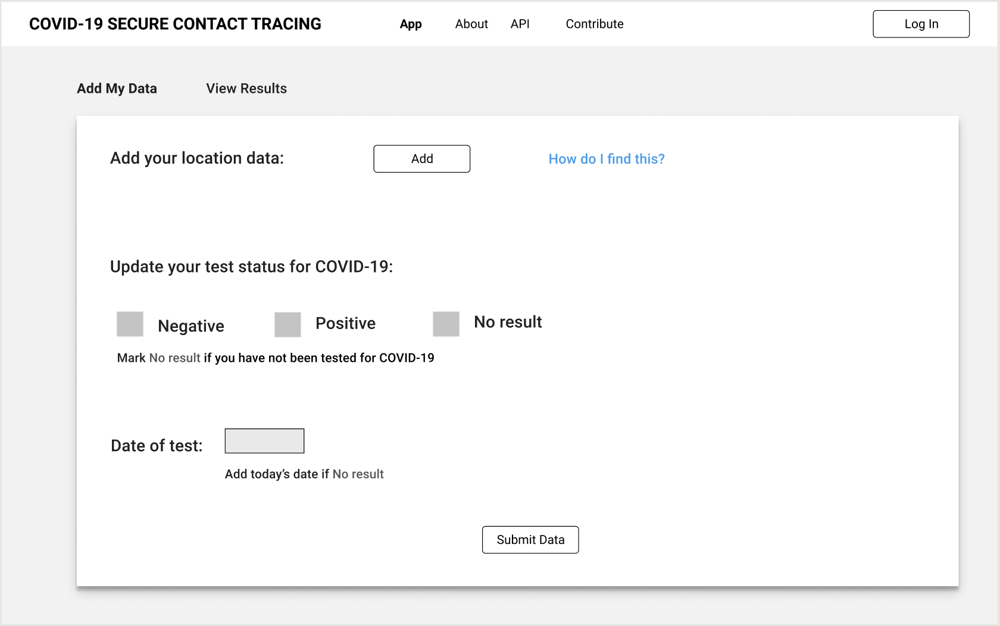
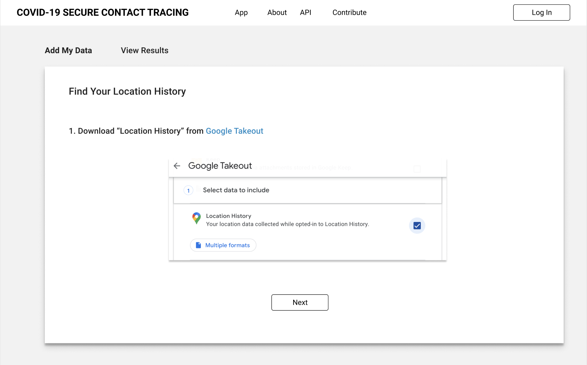
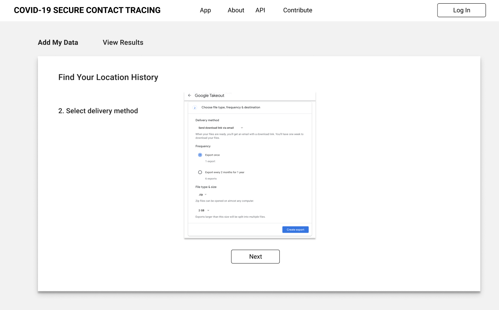
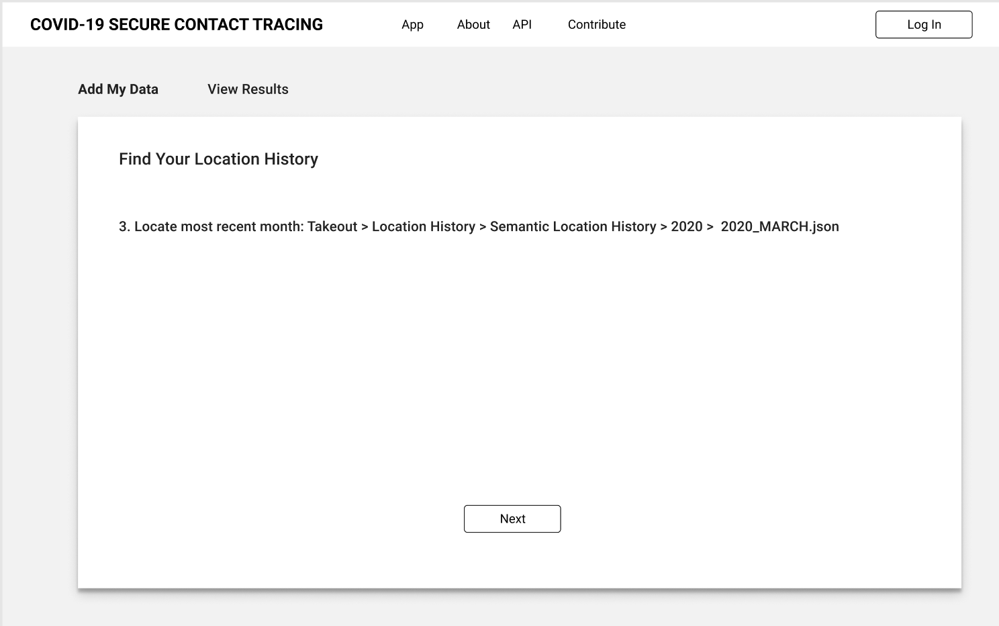

### Adding data

A user adds locations she’s been to for the past 2 weeks indicating date and time and also chooses whether she has i) tested positive, ii) has shown symptoms or iii) has not been tested. This step enables creating a location history / heatmap among users and triggers notifications when a user has been in close proximity with people who have the virus. Alice takes the following steps:
1. Alice creates an account (username and password) and clicks on I want to self-report and is directed to the next screen. This creates the first entries in the encrypted database <<unique_id, status>> 
2. Alice is shown instructions on how to export her data from Google Maps.
3. Alice is sent to Google maps timeline to review her activity in the last 2 weeks
4. Alice reviews her activity
5. Alice (optionally) may manually add / remove locations to / from her activity report
6. Alice is then prompted to use Google takeout
7. Alice goes to Google takeout site and de-selects all and only selects Location History
8. Alice downloads location history in JSON format
9. Alice adds exported location data to the secret contract using the GUI
10. Find month / two months that cover the location history under Semantic Location History
11. Drag and drop this file(s) to the GUI

### Individual reporting
After Bob adds his location history, he’d be shown whether he’s been in close proximity with any reporters in the past two weeks
1. High level report - Bob is shown how many reporters he’s been around within the last X amount of time and Y radius.
2. Detailed report- Bob is shown a list of matching locations where he’s been in close proximity with a reported user. The list contains the following fields:
- Location: Locations should be named by the map API as points of interest. Let’s call this location A
- Distance: This shows the approximate distance between Bob and Alice near location A.
- Time: Time difference between when Alice and Bob have been at location A.

If a new reporter adds her location history and had been in close proximity with Bob, Bob is shown a notification the next time he logs in. If Bob has opted in for notifications, Bob receives an email notification. The notification states that Bob has been in close proximity with a Covid19 positive reporter and is asked to login to the application. 

_Note: Bob should only receive a notification if reporter has been at the same location either before or approximately at the same time. We are currently planning to tackle this using locations where users spent time at from Google Maps export_

### Global reporting (heatmap view)
Bob, who wants to be cautious and identify high risk areas, can navigate the map to see high risk areas based on the number of people who’ve tested positive being present at different times.
Heatmap is created based on the location history of individuals who have tested positive for Covid-19. We propose to create a heatmap using Google Maps API. Heatmap API can take 3 inputs  <<latitude, longitude, weight>>. Weights are assigned to location history based on time (more recent visits getting higher weights)

_Note: It's important to show how self-reporting database compares to official statistics as the self-reporting sample size will only cover a small portion of actual cases in the beginning_

